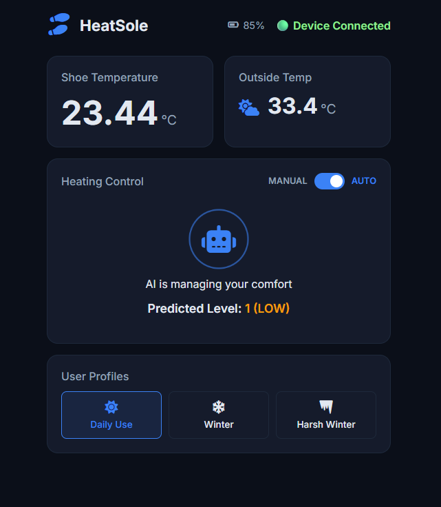

# 🔥 Smart-HeatSole
## 📸 Demo



AI-powered smart heating insole using ESP32, real-time sensors, and machine learning for adaptive comfort.

---

## 💡 What it does

This system automatically adjusts heating levels based on real-time foot temperature and environmental conditions using machine learning.

---

## 🚀 Features

- 🌡️ Real-time temperature monitoring (DS18B20)
- 🤖 AI-based heat prediction (ML model)
- 🌐 Flask backend API
- 📱 Interactive web dashboard (Auto + Manual modes)
- ⚡ ESP32 integration (WiFi communication)
- 🔋 Battery + safety monitoring (overheat protection)

---

## 🧠 Tech Stack

- Frontend: HTML, CSS, JavaScript
- Backend: Flask (Python)
- Machine Learning: scikit-learn
- Hardware: ESP32 + DS18B20 sensor

---

## 🔗 System Architecture

ESP32 → Flask API → ML Model → Heat Decision → UI

---

## ⚙️ How to Run

### 1. Install dependencies
```bash
py -m pip install pandas scikit-learn flask requests flask-cors python-dotenv
```

---

### 2. Setup environment variables
Create .env file:
API_KEY=your_api_key
CITY=your_city

---

### 3. Train model
py train.py

---

### 4. Run backend
py app.py

---

### 5. Open frontend
Open index.html in browser

---
